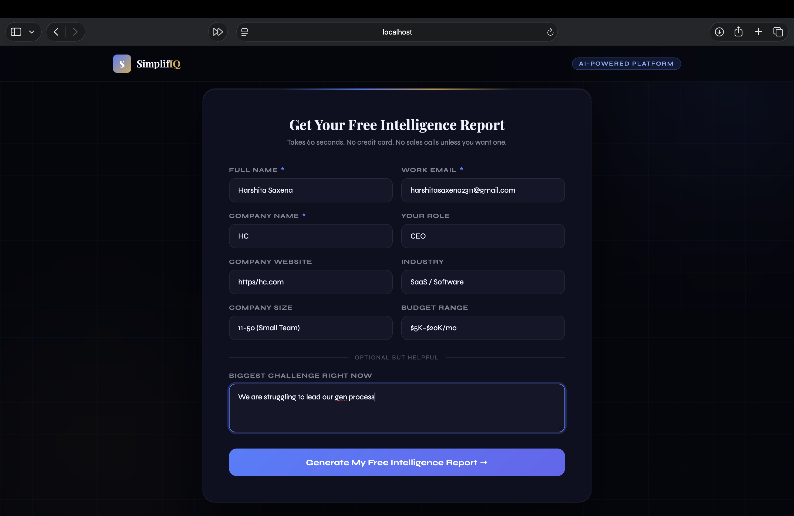
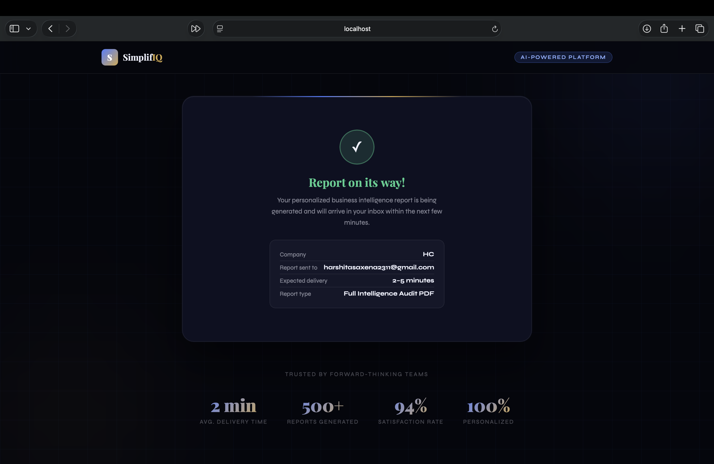
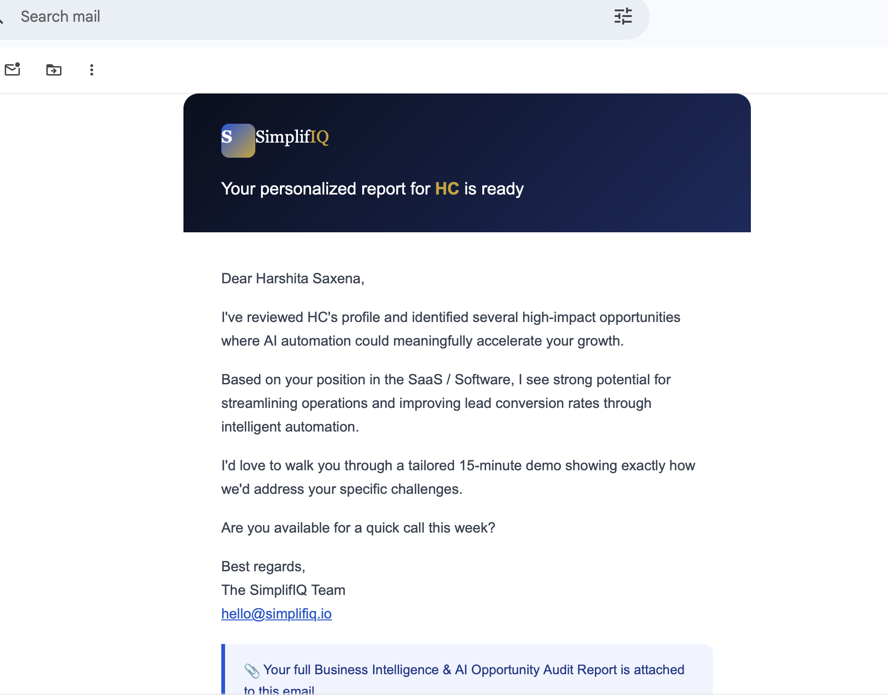
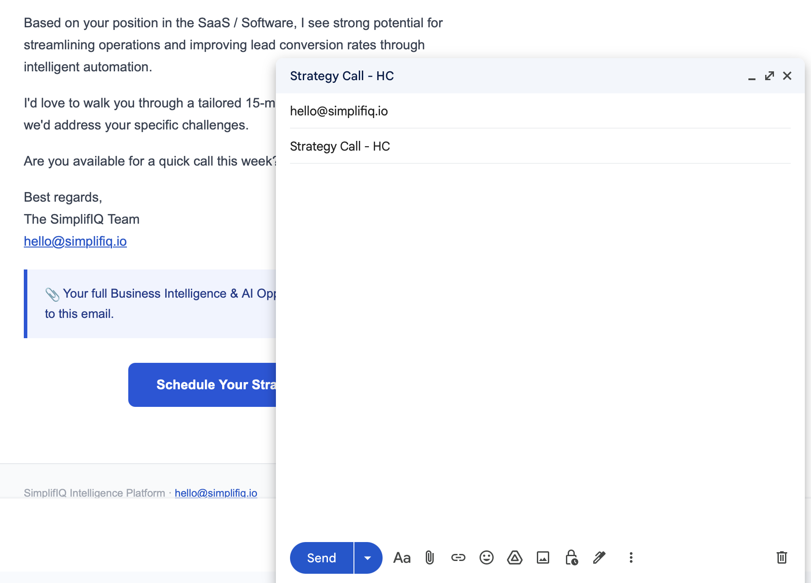

# SimplifIQ — AI Lead Automation System

> A fully automated lead intake → research → PDF report → email delivery pipeline powered by **Grok AI (xAI)**.

---

## 🏗️ Architecture Overview

```
[Lead Form] → [Express API] → [Enrichment] → [Grok AI Research]
                                                     ↓
                              [Email + PDF] ← [PDF Generation] ← [Recommendations]
```

### Pipeline Stages (fully automated)
1. **Form Submission** — validated lead data captured
2. **Web Enrichment** — scrapes company website (Cheerio)
3. **Grok AI Research** — deep company intelligence via xAI Grok API
4. **Recommendations** — personalized strategy recommendations (Grok)
5. **Email Content** — personalized outreach email (Grok)
6. **PDF Generation** — professional 5-page HTML/PDF report
7. **Email Delivery** — report sent via Nodemailer (Gmail SMTP)

---

## 📁 Project Structure

```
simplifiq/
├── index.html        
├── server.js 
│── .env.example      
├── routes/
│   └── leads.js        
├── services/
├── grokService.js     
├── enrichmentService.js 
├── pdfService.js        
├── emailService.js     
│── utils/
│   └── logger.js      
├── reports/                 
└── README.md
```

---

## ⚙️ Setup Instructions

### Prerequisites
- Node.js 18+
- A Grok API key from [x.ai/api](https://x.ai/api)
- Gmail account with App Password (for email)

---

### 1. Install Dependencies

```bash
npm install
```

---

### 2. Configure Environment Variables

```bash
cp .env
```

Edit `.env`:

```env
# Required
GROK_API_KEY=xai-your-key-here
SMTP_USER=you@gmail.com
SMTP_PASS=your-gmail-app-password   # Not your login password!
```

#### Getting Gmail App Password:
1. Go to [myaccount.google.com/security](https://myaccount.google.com/security)
2. Enable 2-Factor Authentication
3. Search "App Passwords" → Create one for "Mail"
4. Use the 16-character password as `SMTP_PASS`

#### Getting Grok API Key:
1. Go to [console.x.ai](https://console.x.ai)
2. Create an account → Generate API key
3. Copy it as `GROK_API_KEY`

---

### 3. Start the server

```bash
node server.js
```

You should see:
```
🚀 SimplifIQ backend running on port 3001
   Grok API: ✅ configured
   SMTP: ✅ configured
```

---

### 4. Open the Frontend

Simply open `index.html` in a browser (or serve it):

```bash
# Option A: Open directly
open index.html

# Option B: Serve with Python
cd frontend && python3 -m http.server 3000

# Option C: With live-server
npx live-server frontend --port=3000
```

---

## 🔑 API Endpoints

### `POST /api/leads`
Submit a new lead — triggers the full pipeline.

**Request Body:**
```json
{
  "name": "Alex Johnson",
  "email": "alex@acme.com",
  "companyName": "Acme Corp",
  "role": "CEO",
  "website": "https://acme.com",
  "industry": "SaaS / Software",
  "companySize": "51-200",
  "budget": "$5K–$20K/mo",
  "challenges": "We need to automate our sales process..."
}
```

**Response (202 Accepted):**
```json
{
  "success": true,
  "message": "Lead received! We're generating your personalized report.",
  "leadId": "lead_1704067200000"
}
```

The pipeline runs asynchronously — the API responds immediately while processing continues in the background.

### `GET /health`
System health check + config status.

---

## 🤖 Grok AI Integration

The system makes **three separate Grok API calls** per lead:

| Call | Model | Purpose | Tokens |
|------|-------|---------|--------|
| Company Research | `grok-3-latest` | Deep intelligence gathering | ~3000 |
| Recommendations | `grok-3-latest` | Personalized strategy | ~2000 |
| Email Content | `grok-3-latest` | Outreach email writing | ~800 |

All prompts include structured JSON output instructions for reliable parsing. Fallbacks handle API failures gracefully.

---

## 📄 Generated Report Sections

1. **Cover Page** — branded, with company name, contact, confidence score
2. **Executive Summary** — AI-generated overview + immediate action items
3. **Company & Industry Profile** — detailed research + competitive landscape
4. **Challenges & AI Opportunities** — specific pain points + automation opportunities
5. **Strategic Recommendations + Next Steps** — prioritized action plan

---

## ⚠️ Assumptions & Tradeoffs

| Decision | Rationale |
|----------|-----------|
| Async pipeline (202 response) | UX: user isn't waiting 30–60s for AI calls |
| Grok JSON prompting | More reliable than unstructured output; parsed with fallback |
| HTML-to-PDF via html-pdf-node | Simpler than Puppeteer; falls back to HTML if Chrome unavailable |
| Cheerio for scraping | Lightweight; handles most sites. Complex SPAs may return minimal data |
| Graceful fallbacks everywhere | API failures don't break the flow — reports are always generated |

---

## 🐛 Troubleshooting

**"GROK_API_KEY is not configured"**
→ Check your `.env` file is in the `backend/` directory and `GROK_API_KEY` is set.

**Email not sending**
→ Verify `SMTP_USER` and `SMTP_PASS` (App Password, not your login). Check `logs/error.log`.

**PDF generation falls back to HTML**
→ This is normal if Chromium/Puppeteer isn't installed. The HTML report is still attached to the email.

**CORS errors in browser**
→ Ensure `FRONTEND_URL` in `.env` matches where you're serving the frontend from.

---

## 📊 Logs

Logs are written to:
- `logs/combined.log` — all events
- `logs/error.log` — errors only
- Console — colored output in development

---
## Preview

### Landing Page


### AI Processing Pipeline


### Generated Report / Email Delivery



## 📄 Sample Generated Report

A sample AI-generated business intelligence report is included in this repository.

[View Sample Report](./sample-report/sample-report.pdf)

### With Docker:
```dockerfile
FROM node:18-alpine

WORKDIR /app

COPY package*.json ./

RUN npm install

COPY . .

EXPOSE 3001

CMD ["node", "server.js"]
```
